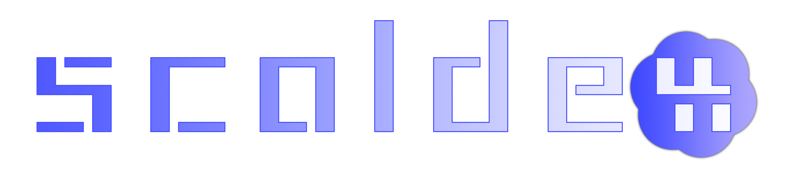
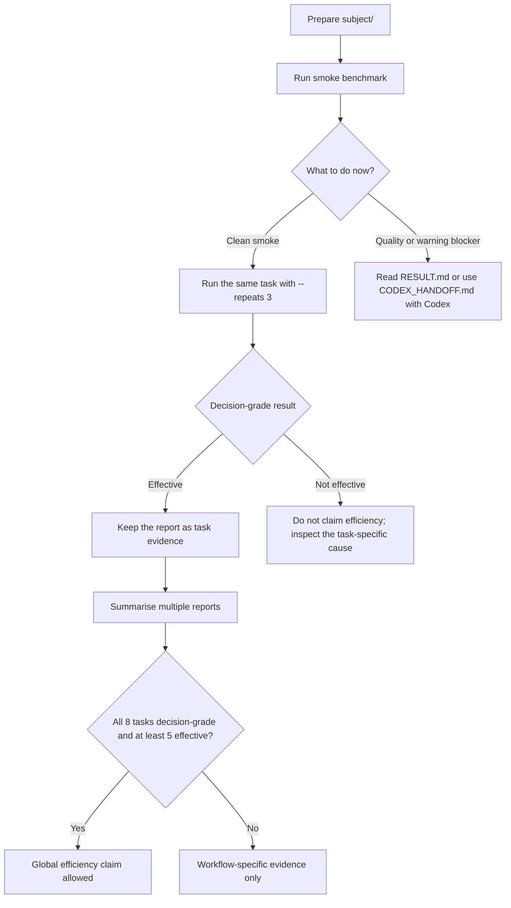

<!-- markdownlint-disable MD033 MD041 -->

<div align="center">




[](#requirements)
[](#install-from-github-source)
[](LICENCE "MIT Licence")

</div>

# scaldex

scaldex measures whether a Codex instruction package helps or hurts Codex token use.

It runs the same benchmark task twice in isolated conditions:

- `agents`: Codex runs with the instruction package you are measuring.
- `control`: Codex runs without that package and without your global `~/.codex` config.

scaldex writes terminal output for humans. Each run also writes `CODEX_HANDOFF.md` for Codex-assisted follow-up. You can inspect the reports yourself, or give the handoff to Codex when you want help interpreting the result or improving the measured package.

## What scaldex answers

- Does this instruction package reduce non-cached input tokens for Codex?
- Did it preserve task quality against the isolated control run?
- Is the result only a smoke check, or strong enough for a decision?
- Should you run another paid benchmark, fix blockers, or avoid an efficiency claim?

scaldex does not change your instructions. It measures, reports, and writes evidence.

## Requirements

- Python 3.11 or newer.
- Git on `PATH`. scaldex uses Git internally for temporary benchmark snapshots; your measured package does not need to be a Git repository.
- Codex CLI on `PATH` with `codex exec` support.
- A Codex API key for paid benchmark runs.

If you are not sure whether these tools are ready, run the doctor command after installation. It does not spend API money.

## Install from GitHub source

Download or clone the scaldex project from GitHub, then open a terminal in the downloaded `scaldex` folder. This is the folder that contains `README.md`, `pyproject.toml` and `run_scaldex.py`.

Install the `scaldex` command:

```sh
python3 -m pip install -e .
```

Then check your local setup without spending API money:

```sh
scaldex bench doctor
```

If you do not want to install the command yet, stay in the downloaded `scaldex` folder and use the wrapper instead:

```sh
python3 run_scaldex.py --help
```

The examples below use the installed `scaldex` command. With the wrapper, replace `scaldex` with `python3 run_scaldex.py` for the main benchmark command.

## First run checklist

Use this checklist for your first measurement:

1. Open a terminal in the downloaded `scaldex` folder.
2. Install scaldex with `python3 -m pip install -e .`.
3. Run `scaldex bench doctor`.
4. Create `subject/`.
5. Put the instruction package you want to measure into `subject/`.
6. Run one smoke benchmark.
7. Read only `What this means` and `What to do now` first.
8. If you want Codex-assisted follow-up, give Codex `scaldex-run/CODEX_HANDOFF.md`.

The smoke command is:

```sh
scaldex --model gpt-5.4 --subject-dir subject --task-id login_test_failure --repeats 1
```

This command starts two paid Codex runs: one `control` run and one `agents` run.

The first-run flow is:



For machine-readable prerequisite output:

```sh
scaldex bench doctor --json
```

## Prepare a subject package

Create a folder for the instruction package you want to measure:

```sh
mkdir -p subject
```

Put `AGENTS.md` or `AGENTS.override.md` in `subject/`. Codex uses these files as instruction entry points. Add any support files or folders your setup relies on, including `.codex/` or custom-named files.

By default, scaldex measures the whole `subject/` package. Use `--subject-mode agents-md` only for a diagnostic run that measures the instruction entry file alone.

Keep generated report folders outside `subject/`. scaldex refuses layouts where `scaldex-run/`, `scaldex-history/`, or other output folders would pollute future measurements.

## Run a smoke benchmark

A smoke run is the low-cost first check. It runs one paired task: one `control` run and one `agents` run. Use the smoke command from the first run checklist above.

If `CODEX_API_KEY` is not set, scaldex asks:

```text
Enter Codex API Key:
```

scaldex uses the key only for that process. It does not write the key into reports, history, or config files. If you do not set `CODEX_API_KEY` yourself, scaldex asks again for each paid command.

## Read the result

The terminal output is the quick decision layer:

- `What this means` explains the verdict.
- `What to do now` tells you whether to stop, use the Codex handoff, run `--repeats 3`, or avoid an efficiency claim.
- `Codex handoff` points to the file Codex can use for follow-up.
- `Evidence` explains token delta, quality and reliability.
- `Audit checks` explains isolation, path integrity and warnings.

scaldex shows quality as a success rate. `1.0` means 100% of that side's required task checks passed. `0.0` means 0% passed.

The run folder contains:

- `scaldex-run/RESULT.md`: human-readable report.
- `scaldex-run/CODEX_HANDOFF.md`: Codex-facing follow-up brief.
- `scaldex-run/result.json`: machine-readable report.

For a deeper explanation of the scoring model, read [docs/MEASUREMENT-MODEL.md](docs/MEASUREMENT-MODEL.md).

scaldex results are workflow-specific. A task that is `not_effective` does not prove that your instruction package is bad; it proves that the package did not help enough for that measured workflow under the benchmark rules.

## Use Codex-assisted follow-up

If you want Codex to act on a result, give it:

```text
scaldex-run/CODEX_HANDOFF.md
```

The handoff tells Codex what evidence exists, which blockers apply, what it may do, and what it must not claim. You can also read `RESULT.md` yourself; scaldex does not require you to use Codex for interpretation.

Do not improve the measured package from a smoke win alone. Smoke evidence only tells you whether a decision-grade run is worth the cost.

## Run decision-grade evidence only when invited

Use at least three paired repeats only when the smoke result says the task is eligible:

```sh
scaldex --model gpt-5.4 --subject-dir subject --task-id login_test_failure --repeats 3
```

Decision-grade evidence is still task-specific. Do not make a global efficiency claim from one task.

## Replay a result without spending money

Replay prints the same result view from an existing `result.json`. It does not ask for an API key and does not run Codex.

```sh
scaldex --print-result scaldex-run/result.json
```

The package CLI can also replay a report:

```sh
scaldex result show scaldex-run/result.json
```

## History and summaries

When a new default run replaces `scaldex-run/`, scaldex archives the previous compact report in `scaldex-history/`.

After you have history, summarise current and older reports without spending money:

```sh
scaldex bench summarize scaldex-history scaldex-run --out scaldex-summary
```

The command prints a decision view in the terminal and writes:

- `scaldex-summary/SCALDEX_SUMMARY.md`
- `scaldex-summary/scaldex-summary.json`

scaldex allows a global efficiency claim only when all eight built-in tasks have decision-grade reports and at least five of those tasks are effective. Unknown task IDs cannot replace missing built-in tasks. A single task, a smoke run, or a blocked quality gate is not enough.

## Built-in tasks

Use `--task-id` to choose one or more built-in benchmark tasks:

- `login_test_failure`: debugging task; checks whether the package helps Codex find a failing test and production cause without broad log reading.
- `export_cli_location`: location task; checks whether Codex can identify an entry point and implementation files quickly.
- `feature_x_plan`: planning task; checks whether Codex finds the relevant service and UI files before proposing a change.
- `release_scope_audit`: audit task; checks whether Codex identifies release-scope files, manifests and risks.
- `small_edit_fix`: minimal-fix task; checks whether Codex identifies the smallest useful code change without broad refactoring.
- `test_failure_with_logs`: log-discipline task; checks whether Codex explains a failing test without dumping large logs.
- `docs_update_scope`: documentation-scope task; checks whether Codex finds the right docs and source references for a documentation change.
- `large_repo_noise`: noisy-repo task; checks whether Codex finds relevant files while avoiding generated or irrelevant noise.

Read [docs/BUILT-IN-TASKS.md](docs/BUILT-IN-TASKS.md) before running the full task set.

The tasks are realistic proxy scenarios, not a copy of your own project. They show where your package helps Codex, where the package stays neutral or harmful, and where more task-specific optimisation needs evidence.

Use `--all-tasks` only when you intentionally want the full task set. It increases paid Codex runs.

## Cost model

Paid Codex run count is:

```text
selected tasks x repeats x 2 variants
```

Examples:

- one task, `--repeats 1`: 2 paid Codex runs
- one task, `--repeats 3`: 6 paid Codex runs
- eight tasks, `--repeats 1`: 16 paid Codex runs
- eight tasks, `--repeats 3`: 48 paid Codex runs

Start with smoke. Continue only when the terminal output or `CODEX_HANDOFF.md` tells you to run the next paid benchmark.

## Safety boundaries

- scaldex isolates runs with dedicated `CODEX_HOME` folders.
- scaldex excludes your global `~/.codex` config from the measured instruction source.
- scaldex keeps subject warnings separate from benchmark warnings.
- scaldex treats benchmark warnings as blockers for efficiency claims.
- scaldex does not store your Codex API key in generated reports.
- scaldex rejects symlinks inside the measured subject package.
- scaldex refuses output layouts that would place generated reports inside the measured subject package.

## Contributing

[Contributions are welcome!](CONTRIBUTING.md "Contributions are welcome!")

## Licence

This project uses the [MIT Licence](LICENCE "MIT Licence"). You may use, change, and distribute it in compliance with the licence terms.
